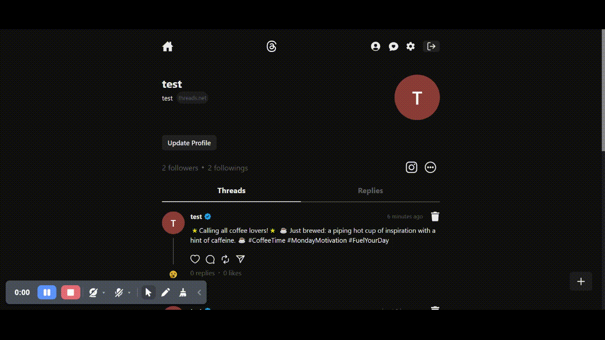

# Threads Clone 🧵

## Introduction

Threads Clone is a social media platform with an integrated chat feature, designed for seamless user interactions. Users can sign up, create text posts, attach images, and engage in real-time conversations. The platform includes features like post replies, likes, user profiles, follow/unfollow functionality, and account management options such as updating user profiles and freezing accounts. The application is fully mobile-responsive, supports dark and light themes, and provides a user-friendly experience.

## Features

### Platform 🌐:

- **Sign up and login**: Users can easily create accounts and log in.
- **Create and view posts**: Users can create text posts and view posts from others.
- **Generate Post with Gemini**: Users can generate posts with Gemini.
- **Reply with AI:**: Users can reply to posts with AI.
- **Dark and light themes**: Choose between dark and light themes for a personalized experience.
- **Attach images**: Users can enhance their posts by attaching images.
- **Engage with posts**: Like and reply to posts similar to tweets.
- **Profile interactions**: Visit user profiles, follow/unfollow, and update user information.
- **Account management**: Freeze/unfreeze accounts and update account information.
- **Suggested users**: Get recommendations for users to follow.
- **Delete posts**: Users can remove their own posts.
- **Logout functionality**: Securely log out of the platform.
- **Real-time updates**: Stay informed with real-time updates for new posts and replies.

### Chat 💬:

- **Send text and images**: Users can communicate with each other using text and images.
- **Online user status**: Know when users are online.
- **Notification tones**: Receive notification tones for new messages when the chat is out of focus.
- **Read receipts**: Check if a message has been seen by the recipient.

## Technologies Used 🚀

- **React**: Building user interfaces with ease.
- **Node.js**: Server-side JavaScript runtime.
- **Express.js**: Web application framework for Node.js.
- **MongoDB**: Document database for storing application data.
- **Mongoose**: MongoDB object modeling tool for Node.js.
- **JWT**: JSON Web Token for secure user authentication.
- **Bcrypt**: Password hashing for secure user authentication.
- **Gemini**: AI model for generating text replies and posts.
- **Socket.IO**: Real-time communication for a responsive chat experience.
- **Chakra UI**: UI component library for React applications.
- **Cloudinary**: Cloud-based image and video management platform.

## Screenshots / Preview 📸

## AI Preview 🤖

## Test Account

For users who want to explore Threads Clone without creating a personal account, we provide a test account for convenience. Feel free to use the following credentials:

- **Username:** test
- **Password:** test

## Live Link 🔗

[Threads Clone Live Demo](https://example.com)

## Acknowledgements

- **Developer:** Zeeshan Mukhtar
  - LinkedIn: [Zeeshan Mukhtar](https://www.linkedin.com/in/zeeshanmukhtar1/)

This project is a follow-along tutorial inspired by the [FreeCodeCamp](https://www.freecodecamp.org/) tutorial. Special thanks to FreeCodeCamp for providing valuable learning resources and guidance.

## Contributing 🤝

Contributions, issues, and feature requests are welcome!
please feel free to open an issue or create a pull request.

## License 📜

Threads Clone is open source and distributed under the [MIT License](LICENSE). Feel free to use, modify, and distribute the source code as per the terms of the license.
